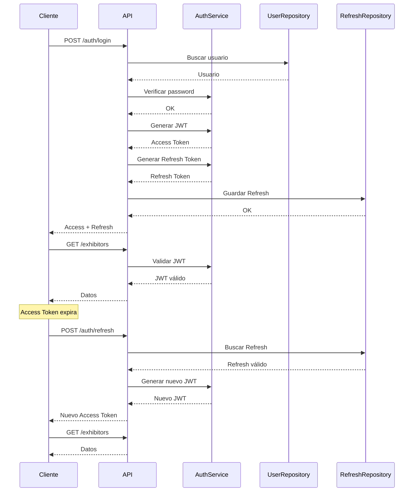

```mermaid
sequenceDiagram

    participant Cliente
    participant API
    participant AuthService
    participant UserRepository
    participant RefreshRepository

    Cliente->>API: POST /auth/login
    API->>UserRepository: Buscar usuario

    UserRepository-->>API: Usuario

    API->>AuthService: Verificar password

    AuthService-->>API: OK

    API->>AuthService: Generar JWT

    AuthService-->>API: Access Token

    API->>AuthService: Generar Refresh Token

    AuthService-->>API: Refresh Token

    API->>RefreshRepository: Guardar Refresh

    RefreshRepository-->>API: OK

    API-->>Cliente: Access + Refresh

    Cliente->>API: GET /exhibitors

    API->>AuthService: Validar JWT

    AuthService-->>API: JWT válido

    API-->>Cliente: Datos

    Note over Cliente: Access Token expira

    Cliente->>API: POST /auth/refresh

    API->>RefreshRepository: Buscar Refresh

    RefreshRepository-->>API: Refresh válido

    API->>AuthService: Generar nuevo JWT

    AuthService-->>API: Nuevo JWT

    API-->>Cliente: Nuevo Access Token

    Cliente->>API: GET /exhibitors

    API-->>Cliente: Datos

```
