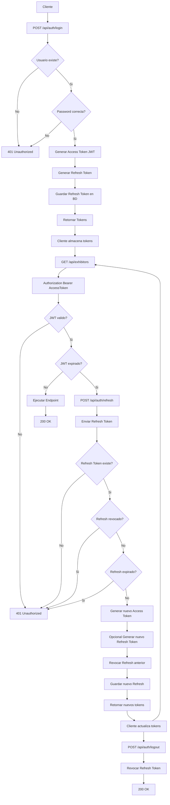

```mermaid
flowchart TD

    A[Cliente] --> B[POST /api/auth/login]

    B --> C{Usuario existe?}

    C -- No --> D[401 Unauthorized]

    C -- Si --> E{Password correcta?}

    E -- No --> D

    E -- Si --> F[Generar Access Token JWT]
    F --> G[Generar Refresh Token]
    G --> H[Guardar Refresh Token en BD]
    H --> I[Retornar Tokens]

    I --> J[Cliente almacena tokens]

    J --> K[GET /api/exhibitors]

    K --> L[Authorization Bearer AccessToken]

    L --> M{JWT valido?}

    M -- No --> N[401 Unauthorized]

    M -- Si --> O{JWT expirado?}

    O -- No --> P[Ejecutar Endpoint]
    P --> Q[200 OK]

    O -- Si --> R[POST /api/auth/refresh]

    R --> S[Enviar Refresh Token]

    S --> T{Refresh Token existe?}

    T -- No --> N

    T -- Si --> U{Refresh revocado?}

    U -- Si --> N

    U -- No --> V{Refresh expirado?}

    V -- Si --> N

    V -- No --> W[Generar nuevo Access Token]

    W --> X[Opcional Generar nuevo Refresh Token]

    X --> Y[Revocar Refresh anterior]

    Y --> Z[Guardar nuevo Refresh]

    Z --> AA[Retornar nuevos tokens]

    AA --> AB[Cliente actualiza tokens]

    AB --> K

    AB --> AC[POST /api/auth/logout]

    AC --> AD[Revocar Refresh Token]

    AD --> AE[200 OK]

```
